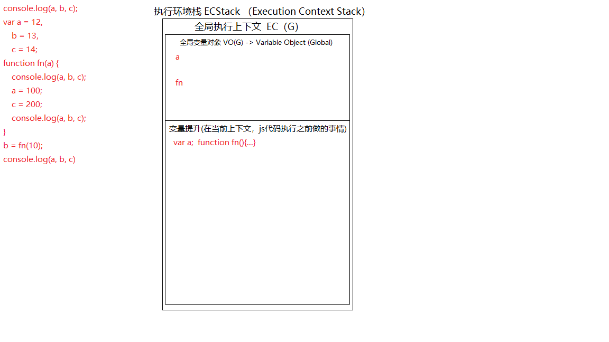
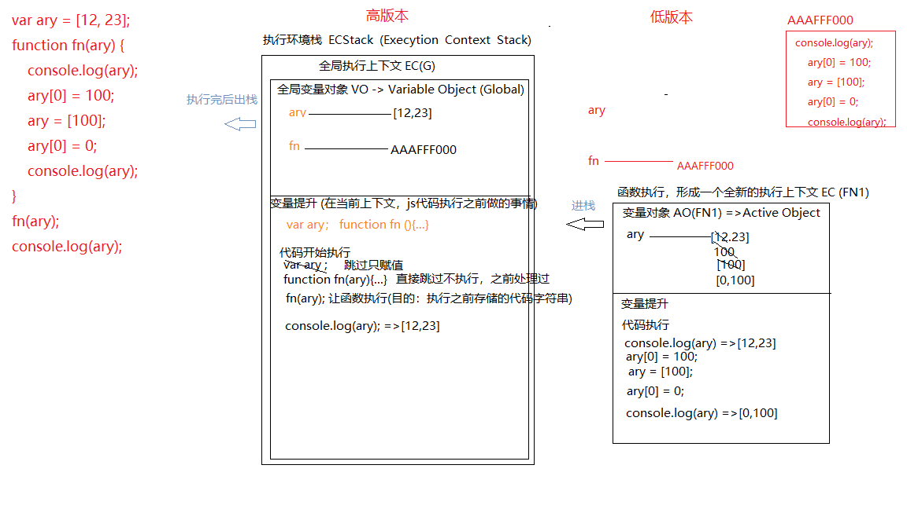
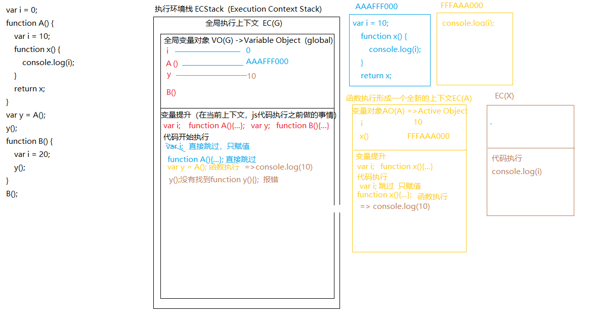
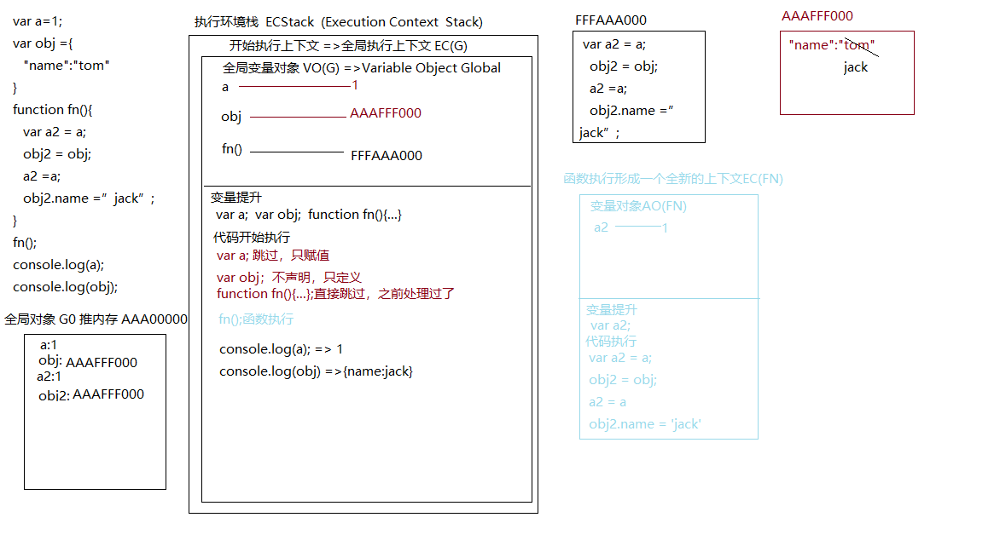
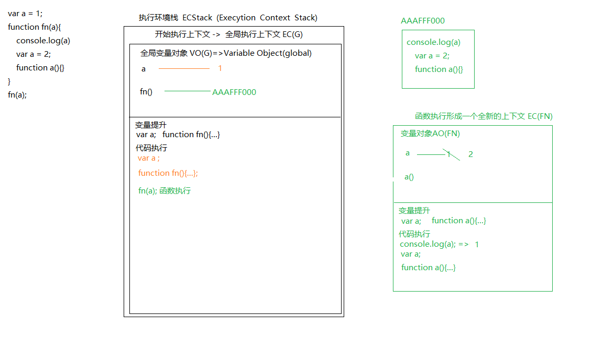
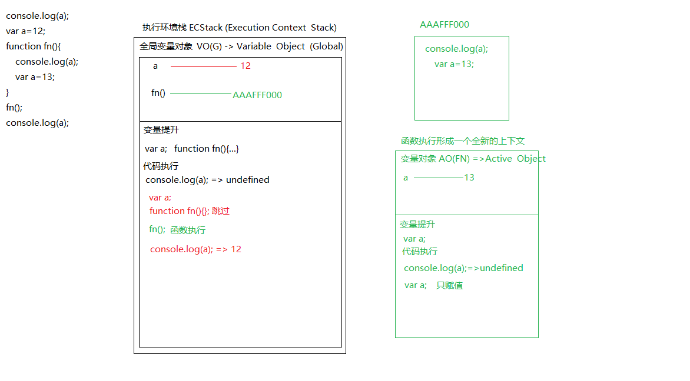
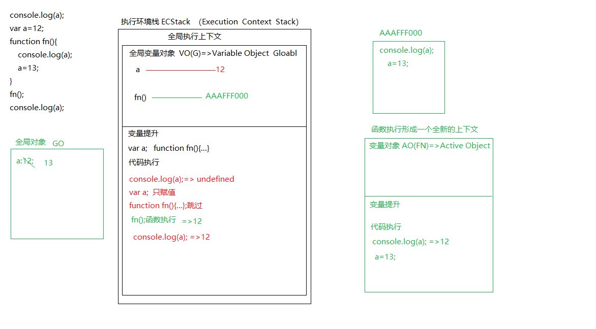
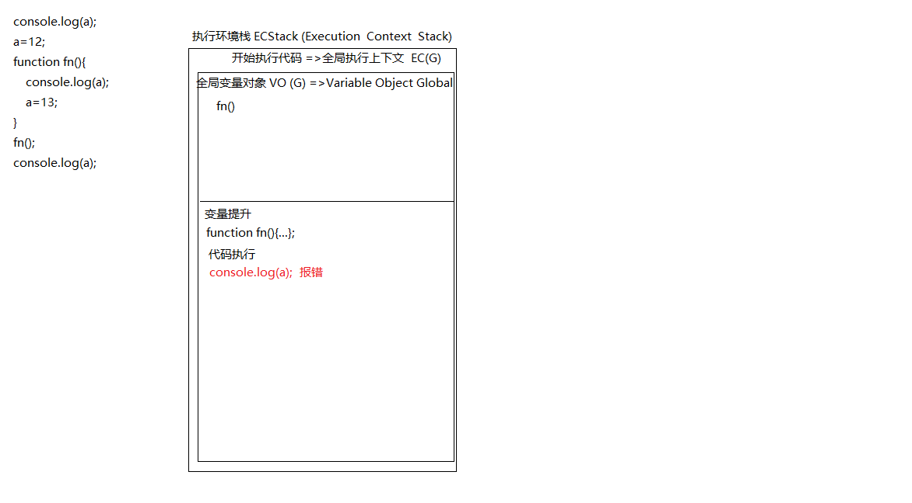
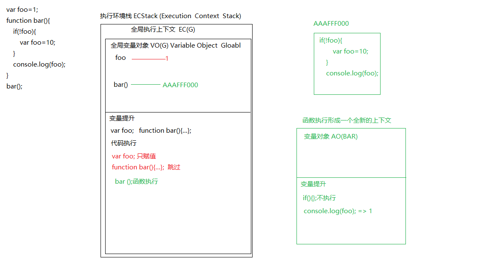
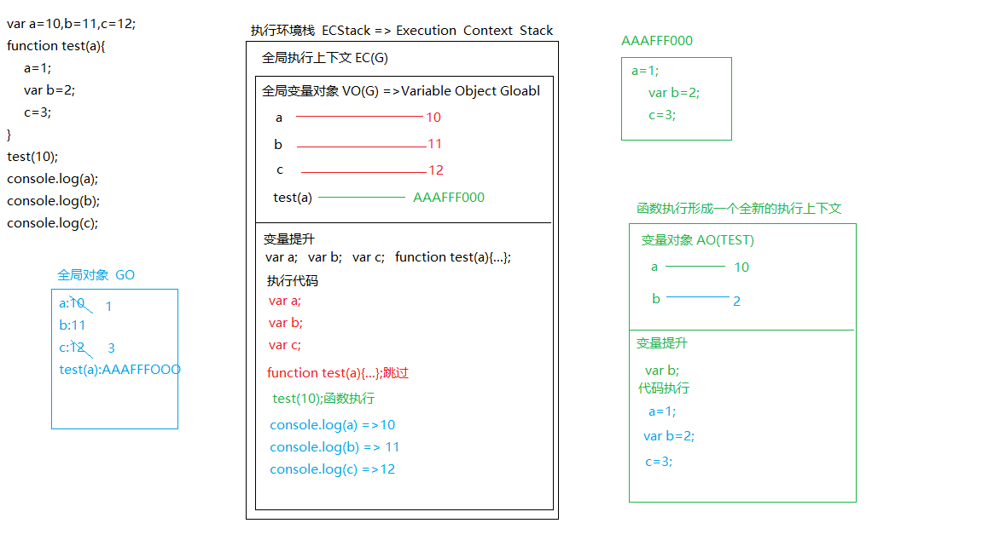

## 第一周正式课-课后作业（1）
### 1.
- undefined    12
- 报错
- 报错
### 2.
#### 高版本
- undefined     报错
#### 低版本
- 12       报错

### 3.
- [12,23]       [0,100]     [12,23]
 
### 4.
- 10    报错

### 5.
- 1      {name:jack}

### 6.
- 1

### 7.
- undefined         12

- undefined    12      12

- 报错

### 8.
- 1

### 9.
- 10      11       12

### 10.
- 1
### 11.
- 3        10        4
### 12.
- "hello"     不会      “hello”        

 